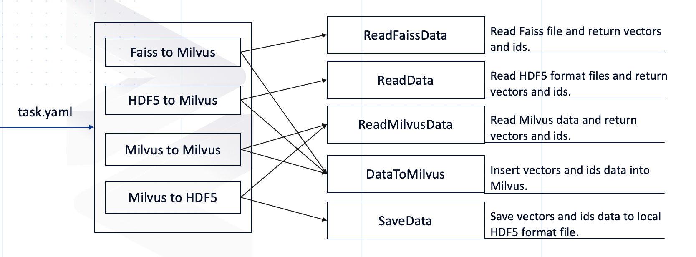

# Milvus Data Migration Tool
## Overview

Milvusdm (Milvus Data Migration) is an open-source tool designed specifically for importing and exporting [Milvus](https://milvus.io/) data files. With the following four features, Milvusdm can greatly improve efficiency of data management and reduce DevOps costs:

- Faiss to Milvus: Imports unzipped data from Faiss into Milvus.
- HDF5 to Milvus: Imports HDF5 files into Milvus.
- Milvus to Milvus: Migrates data from a source Milvus to the target Milvus.
- Milvus to HDF5: Saves the data in Milvus as HDF5 files.

 

## Getting started
### Prerequisites
- Operating system requirements

| Operating system | Supported versions |
| :--------------- | :----------------- |
| CentOS           | 7.5 or higher      |
| Ubuntu LTS       | 18.04 or higher    |

- Software requirements

| Software                     | Version                        |
| :--------------------------- | :----------------------------- |
| [Milvus](https://milvus.io/) | 0.10.x                         |
| Python3                      | 3.7 or higher                  |
| pip3                         | Corresponds to python version. |

### Install

- Configure environment variables

Add the following two lines to `~/.bashrc` file:

```bash
export MILVUSDM_PATH='/home/$user/milvusd'
export LOGS_NUM=0
```

> MILVUSDM_PATH: This parameter defines the working path of milvusdm. Logs and data generated by Milvusdm will be stored in this path. The default value is `/home/$user/milvusdm`.
>
> LOGS_NUM: Milvusdm log file generates one per day. This parameter defines the number of log files to be saved. The default value is 0, which means all log files are saved.

Make the configured environment variables：

```shell
$ source ~/.bashrc
```

- Install milvusdm by pip

```shell
$ pip3 install pymilvusdm
```

## How to use

### Faiss to Milvus
Export one Faiss index file to Milvus in specified collection or partition.

> In the current version, only flat and ivf_flat indexes for floating data are supported.

- Download the example yaml

```shell
$ wget https://raw.githubusercontent.com/milvus-io/milvus-tools/main/yamls/F2M.yaml
```

- Config the yaml

```yaml
F2M:
  milvus_version: 0.10.5
  data_path: '/home/data/faiss1.index'
  dest_host: '127.0.0.1'
  dest_port: 19530
  mode: 'append'
  dest_collection_name: 'test'
  dest_partition_name: ''
  collection_parameter:
    dimension: 256
    index_file_size: 1024
    metric_type: 'L2'
```

> 1. Optional parameters: `dest_partition_name`
> 2. The  Parameter `mode` can be selected from `append`, `skip`, `overwrite`.  This parameter takes effect only when the specified collection name exists in Milvus library.
>    - Skip: Ignore if the collection or partition already exists.
>    - Append: Append data if the collection or partition already exists.
>    - Overwrite: If the collection or partition already exists, delete the data before inserting it.

- Parameter description

| parameter            | description                                                  | example                                                      |
| -------------------- | ------------------------------------------------------------ | ------------------------------------------------------------ |
| F2M                  | Task: Export data in HDF5  to Milvus.                        |                                                              |
| milvus_version       | Version of Milvus.                                           | 0.10.5                                                       |
| data_path            | The path of faiss data                                       | '/home/user/data/faiss.index'                                |
| dest_host            | Your Milvus server address.                                  | '127.0.0.1'                                                  |
| dest_port            | Port of your Milvus server.                                  | 19530                                                        |
| mode                 | The mode for importing data to Milvus.                       | 'append'                                                     |
| dest_collection_name | Name of the collection to import data into.                  | 'test'                                                       |
| dest_partition_name  | Name of the partition to import data into.(Optional)         | 'partition'                                                  |
| collection_parameter | Collection-specific information such as vector dimension, index file size, and distance metric. | dimension: 512<br/>index_file_size: 1024<br/>metric_type: 'HAMMING' |

- Usage

```shell
$ milvusdm --yaml F2M.yaml
```


### HDF5 to Milvus

Export one or more HDF5 file to Milvus in specified collection or partition.
>We provide the HDF5 examples of [float vectors](examples/float_example.h5)(dim-100) and [binary vectors](examples/byte_example.h5)(dim-512) and their corresponding ids.

- Download the yaml

```shell
$ wget https://raw.githubusercontent.com/milvus-io/milvus-tools/main/yamls/H2M.yaml
```

- Config the yaml

```yaml
H2M:
  milvus-version: 0.10.5
  data_path:
    - /Users/zilliz/float_1.h5
    - /Users/zilliz/float_2.h5
  data_dir:
  dest_host: '127.0.0.1'
  dest_port: 19530
  mode: 'overwrite'        # 'skip/append/overwrite'
  dest_collection_name: 'test_float'
  dest_partition_name: 'partition_1'
  collection_parameter:
    dimension: 128
    index_file_size: 1024
    metric_type: 'L2'
```

or

```yaml
H2M:
  milvus_version: 0.10.5
  data_path:
  data_dir: '/Users/zilliz/HDF5_data'
  dest_host: '127.0.0.1'
  dest_port: 19530
  mode: 'append'        # 'skip/append/overwrite'
  dest_collection_name: 'test_binary'
  dest_partition_name: 
  collection_parameter:
    dimension: 512
    index_file_size: 1024
    metric_type: 'HAMMING'
```

>1. Optional parameters: `dest_partition_name`
>2. Just configure `data_path` or `data_dir`, while the other one is None.

- Parameter description

| parameter            | description                                                  | example                                                      |
| -------------------- | ------------------------------------------------------------ | ------------------------------------------------------------ |
| H2M                  | Task: Export data in HDF5  to Milvus.                        |                                                              |
| milvus_version       | Version of Milvus.                                           | 0.10.5                                                       |
| data_path            | List of HDF5 files.                                          | - /Users/zilliz/float_1.h5<br />- /Users/zilliz/float_1.h5   |
| data_dir             | Path of directory containing HDF5 files.                     | /Users/zilliz/Desktop/HDF5_data                              |
| dest_host            | Your Milvus server address.                                  | '127.0.0.1'                                                  |
| dest_port            | Port of your Milvus server.                                  | 19530                                                        |
| mode                 | The mode for importing data to Milvus.                       | 'append'                                                     |
| dest_collection_name | Name of the collection to import data into.                  | 'test_float'                                                 |
| dest_partition_name  | Name of the partition to import data into.                   | 'partition_1'                                                |
| collection_parameter | Collection-specific information such as vector dimension, index file size, and distance metric. | dimension: 512<br/>index_file_size: 1024<br/>metric_type: 'HAMMING' |

- Usage

```shell
$ milvusdm --yaml H2M.yaml
```

### Milvus to Milvus

Copy a collection of source_milvus or multiple partitions of a collection into the corresponding collection or partition in dest_milvus. 

- Download the yaml

```bash
$ wget https://raw.githubusercontent.com/milvus-io/milvus-tools/main/yamls/M2M.yaml
```

- Config the yaml

```yaml
M2M:
  milvus_version: 0.10.5
  source_milvus_path: '/home/user/milvus'
  mysql_parameter:
    host: '127.0.0.1'
    user: 'root'
    port: 3306
    password: '123456'
    database: 'milvus'
  source_collection: # specify the 'partition_1' and 'partition_2' partitions of the 'test' collection.
    test:
      - 'partition_1'
      - 'partition_2'
  dest_host: '127.0.0.1'
  dest_port: 19530
  mode: 'skip' # 'skip/append/overwrite'
```

Or

```yaml
M2M:
  milvus_version: 0.10.5
  source_milvus_path: '/home/user/milvus'
  mysql_parameter:
  source_collection: # specify the collection named 'test'
    test:
  dest_host: '127.0.0.1'
  dest_port: 19530
  mode: 'skip' # 'skip/append/overwrite'
```

> 1. Required parameters: `source_milvus_path`, `source_collection`, `dest_host`, `dest_port` and `mode`.
> 2. If you are using MySQL to manage source_milvus metadata, configure the `mysql_parameter` parameter, which is empty if you are using SQLite.
> 3. The `source_collection` parameter must specify a collection name, and the following partition name is optional and multiple partitions can be added.

- Parameter Description


| parameter          | description                                                  | example                                                      |
| ------------------ | ------------------------------------------------------------ | ------------------------------------------------------------ |
| M2M                | Task: Copy the data from Milvus to the same version of Milvus. |                                                              |
| milvus_version     | The dest-milvus version.                                     | 0.10.5                                                       |
| source_milvus_path | Work path to the source Milvus.                              | '/home/user/milvus'                                          |
| mysql_parameter    | MySQL settings for the source Milvus. If MySQL is not used, set mysql_parameter as ''. | host: '127.0.0.1'<br/>user: 'root'<br/>port: 3306<br/>password: '123456'<br/>database: 'milvus' |
| source_collection  | Names of the collection and its partitions in the source Milvus. | test:<br/>      - 'partition_1'<br/>      - 'partition_2'    |
| dest_host          | Your Milvus server address.                                  | '127.0.0.1'                                                  |
| dest_port          | Port of your Milvus server.                                  | 19530                                                        |
| mode               | The mode for importing data to destination Milvus.           | 'skip'                                                       |

- Usage

  It will copy the `source_milvus` collection data to `dest_milvus`.

```bash
$ milvusdm --yaml M2M.yaml
```

### Milvus to HDF5

Export a Milvus collection or multiple partitions of a collection to a local HDF5 format file. 

- Download the yaml

```bash
$ wget https://raw.githubusercontent.com/milvus-io/milvus-tools/main/yamls/M2H.yaml
```

- Config the yaml

```yaml
M2H:
  milvus_version: 0.10.5
  source_milvus_path: '/home/user/milvus'
  mysql_parameter:
    host: '127.0.0.1'
    user: 'root'
    port: 3306
    password: '123456'
    database: 'milvus'
  source_collection: # specify the 'partition_1' and 'partition_2' partitions of the 'test' collection.
    test:
      - 'partition_1'
      - 'partition_2'
  data_dir: '/home/user/data'
```

Or

```yaml
M2H:
  milvus_version: 0.10.5
  source_milvus_path: '/home/user/milvus'
  mysql_parameter:
  source_collection: # specify the collection named 'test'
    test:
  data_dir: '/home/user/data'
```

> 1. The `source_milvus_path`, `source_collection`, and `data_dir` parameters are required.
> 2. If you are using MySQL to manage source_milvus metadata, configure the `mysql_parameter` parameter, which is empty if you are using SQLite.
> 3. The `source_collection` parameter must specify a collection name, and the following partition name is optional and multiple partitions can be added.

- Parameter description


| parameter          | description                                                  | example                                                      |
| ------------------ | ------------------------------------------------------------ | ------------------------------------------------------------ |
| M2H                | Task: Export Milvus data to local HDF5 format files.         |                                                              |
| milvus_version     | The source-milvus version.                                   | 0.10.5                                                       |
| source_milvus_path | Work path to the source Milvus.                              | '/home/user/milvus'                                          |
| mysql_parameter    | MySQL settings for the source Milvus. If MySQL is not used, set mysql_parameter as ''. | host: '127.0.0.1'<br/>user: 'root'<br/>port: 3306<br/>password: '123456'<br/>database: 'milvus' |
| source_collection  | Names of the collection and its partitions in the source Milvus. | test:<br/>      - 'partition_1'<br/>      - 'partition_2'    |
| data_dir           | Directory for holding the saved HDF5 files.                  | '/home/user/data'                                            |

- Usage

  It will generate the corresponding hfd5 format file and H2M configuration file in the `data_dir` directory.

```bash
$ milvusdm --yaml M2H.yaml
```

## Code Structure

If you would like to contribute code to this project, you can find out more about our code structure:



- pymilvusdm
  - core
    - **milvus_client.py**: Performs client operations in Milvus.
    - **read_data.py**: Reads the HDF5 data files on your local drive. (Add your code here to support reading data files in other formats.)
    - **read_faiss_data.py**: Reads the data files in Faiss.
    - **read_milvus_data.py**: Reads the data files in Milvus.
    - **ead_milvus_meta.py**: Reads the metadata in Milvus.
    - **data_to_milvus.py**: Creates collections or partitions based on parameters in YAML files and imports the vectors and the corresponding vector IDs into Milvus.
    - **save_data.py**: Saves the data as HDF5 files.
    - **write_logs.py**: Writes logs during runtime.
  - **faiss_to_milvus.py**: Imports data from Faiss into Milvus.
  - **hdf5_to_milvus.py**: Imports data in HDF5 files into Milvus.
  - **milvus_to_milvus.py**: Migrates data from a source Milvus to the target Milvus.
  - **milvus_to_hdf5.py**: Exports data in Milvus and saves them as HDF5 files.
  - **main.py**: Performs corresponding tasks according to the received YAML file.
  - **setting.py**: Configurations relating to running the Milvusdm code.
- **setup.py**: Creates **pymilvusdm** file packages and uploads them to PyPI (Python Package Index).

## Todo

- [ ] Faiss to Milvus
  - [ ] Supports vector data of binary type.
- [ ] Milvus to Milvus
  - [ ] Specify multiple collections or multiple partitions based on blocklist and allowlist.
  - [ ] When `source_collection='*'`, all Milvus data is exported.
  - [ ] Support for merging multiple collections or partitions in source_milvus into one collection in dest_milvus.
- [ ] Milvud Dump
- [ ] Milvus Restore


