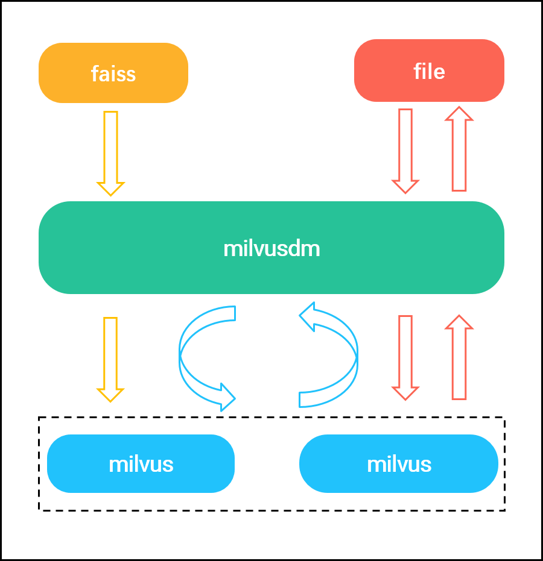

## 简介

Milvusdm (Milvus Data Migration) is a data migration tool for [Milvus](https://milvus.io/) that supports importing Faiss and HDF5 data files into Milvus, migrating data between the same version of Milvus, and it also supports batch backup of Milvus data to local files. Using milvusdm can help developers improve usage efficiency, reduce operation and maintenance costs.

## Function Introduction

**Faiss to Milvus (F2M)**

F2M is used to import data from faiss index file into milvus. It support importing Faiss vectors into a collection or partition specified in Milvus. In the current version, only flat and ivf_flat indexes for floating data are supported.

> Only float vectors are supported in the current version, and binary vectors will be added in the next version.

**HDF5 to Milvus(H2M)**

H2M supports exporting one or more HDF5 file to Miluvs in specified collection or partition.

1. Supports importing float or binary vectors from hdf5 files to a specified collection or partition in Milvus.
2. Support for specifying the ID corresponding to the vector imported into Milvus.

**Milvus to Milvus(M2M)**

M2M is used to export data from Milvus collections to another Milvus. It support importing data from multiple collections or partitions in Milvus1 into the corresponding collections or partitions in Milvus2.

> Merge data from multiple collections or partitions in Milvus1 into a single collection in Milvus2.

**Milvus to HDF5(M2H)** 

M2H is used to export data in Milvus and save it as a file in Hdf5 format. It supports exporting data from one or more collections/partitions.

## System Flow

### Faiss to Milvus

- ReadFaissData(data_path) : Read Faiss file and return vectors and ids.

> The parameter `data_path` refers to the file path of Faiss.

- DataToMilvus(dest_host, dest_port, mode, dest_collection_name, dest_partition_name, collection_parameter, vectors, ids) :Insert vectors into Milvus. 

> The parameters `dest_partition_name` and `ids` are optional.
>
> The parameter  `mode` indicates the way to insert data. Optional append, skip, overwrite.

### HDF5 to Milvus

- ReadData(data_path) : Read HDF5 format files and return vectors and ids.

> The parameter `data_path` refers to the data file path. 

- DataToMilvus(dest_host, dest_port, mode, dest_collection_name, dest_partition_name, collection_parameter, vectors, ids) :Insert vectors into Milvus. 

> The parameters `dest_partition_name` and `ids` are optional.
>
> The parameter  `mode` indicates the way to insert data. Optional append, skip, overwrite.

### Milvus to HDF5

- ReadMilvusDB(milvus_dir, mysql_p, collection_name, partition_tag) : Read Milvus data and return vectors and ids.

> The parameter `mysql_p` contains configuration information for mysql: host, port, user, password, database.

- SaveData(data_dir, vectors, ids) : Save vectors and ids data to loacl HDF5 format file. 

> The parameter `data_dir`  indicates the path where the data file is stored

### Milvus to Milvus

- ReadMilvusDB(milvus_dir, mysql_p, collection_name, partition_tag) : Read Milvus data and return vectors and ids.

> The parameter `mysql_p` contains configuration information for mysql: host, port, user, password, database.

- DataToMilvus(dest_host, dest_port, mode, dest_collection_name, dest_partition_name, collection_parameter, vectors, ids) :Insert vectors into Milvus. 

> The parameters `dest_partition_name` and `ids` are optional.
>
> The parameter  `mode` indicates the way to insert data. Optional append, skip, overwrite.

## Parameter Description

**Faiss to Milvus**

| parameter            | description                                     | example                                                      |
| -------------------- | ----------------------------------------------- | ------------------------------------------------------------ |
| F2M                  | Task: Export data in HDF5  to Milvus.           |                                                              |
| milvus_version       | Version of Milvus.                              | 0.10.5                                                       |
| data_path            | The path of fairs data                          | '/home/user/data/faiss.index'                                |
| dest_host            | Host of Milvus.                                 | '127.0.0.1'                                                  |
| dest_port            | Port of Milvus.                                 | 19530                                                        |
| mode                 | The mode for importing data to Milvus.          | 'append'                                                     |
| dest_collection_name | Collection to be imported fairs data.           | 'test'                                                       |
| dest_partition_name  | Partition to be imported fairs data. (Optional) | 'partition'                                                  |
| collection_parameter | Parameters used to create the collection.       | dimension: 512 index_file_size: 1024 metric_type: 'HAMMING' |

**HDF5 to Milvus **

| parameter            | description                                   | example                                                      |
| -------------------- | --------------------------------------------- | ------------------------------------------------------------ |
| H2M                  | Task: Export data in HDF5  to Milvus.         |                                                              |
| milvus_version       | Version of Milvus.                            | 0.10.5                                                       |
| data_path            | List of HDF5 files.                           | - /Users/zilliz/float_1.h5 - /Users/zilliz/float_1.h5   |
| data_dir             | Path of directory containing HDF5 files.      | /Users/zilliz/Desktop/HDF5_data                              |
| dest_host            | Host of Milvus.                               | '127.0.0.1'                                                  |
| dest_port            | Port of Milvus.                               | 19530                                                        |
| mode                 | The mode for importing data to Milvus.        | 'append'                                                     |
| dest_collection_name | Collection to be imported HDF5 data.          | 'test_float'                                                 |
| dest_partition_name  | Partition to be imported HDF5 data.(optional) | 'partition_1'                                                |
| collection_parameter | Parameters used to create the collection.     | dimension: 512 index_file_size: 1024 metric_type: 'HAMMING' |

**Milvus to Milvus**

| parameter          | description                                                  | example                                                      |
| ------------------ | ------------------------------------------------------------ | ------------------------------------------------------------ |
| M2M                | Task: Copy the data from Milvus to the same version of Milvus. |                                                              |
| milvus_version     | The dest-milvus version.                                     | 0.10.5                                                       |
| source_milvus_path | The local path of the Milvus container to be mounted.        | '/home/user/milvus'                                          |
| mysql_parameter    | Use Mysql for metadata management related parameters, including mysql `host`, `user`, ` port`, `password` and `database` parameters. | host: '127.0.0.1' user: 'root' port: 3306 password: '123456' database: 'milvus' |
| source_collection  | The name of the collection or partition specified when exporting Milvus data. | test:       - 'partition_1'       - 'partition_2'    |
| dest_host          | Destination Milvus port.                                     | '127.0.0.1'                                                  |
| dest_port          | Destination Milvus port.                                     | 19530                                                        |
| mode               | The mode for importing data to destination Milvus.           | 'skip'                                                       |

**Milvus to HDF5**

| parameter          | description                                                  | example                                                      |
| ------------------ | ------------------------------------------------------------ | ------------------------------------------------------------ |
| M2H                | Task: Export Milvus data to local HDF5 format files.         |                                                              |
| milvus_version     | The source-milvus version.                                   | 0.10.5                                                       |
| source_milvus_path | The local path of the Milvus container to be mounted.        | '/home/user/milvus'                                          |
| mysql_parameter    | Use Mysql for metadata management related parameters, including mysql `host`, `user`, ` port`, `password` and `database` parameters. | host: '127.0.0.1' user: 'root' port: 3306 password: '123456' database: 'milvus' |
| source_collection  | The name of the collection or partition specified when exporting Milvus data. | test:       - 'partition_1'       - 'partition_2'    |
| data_dir           | Local path of the hdf5 format file.                          | '/home/user/data'                                            |